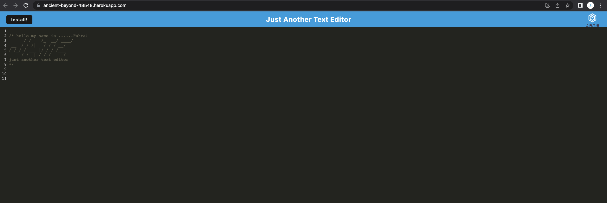

# PWA - Text Editor

#### Check the deployed app [here]( https://morning-thicket-81501.herokuapp.com/)


## Table of Contents

- [Summary](#summary)
- [User Story](#user-story)
- [Technologies Used](#technologies)
- [Acceptance Criteria](#acceptance-criteria)
- [Installation](#installation)
- [License](#license)
- [Questions](#questions)

<a name="summary"></a>

## Summary

The Text editor is an application that runs in the browser. The app will is a single-page application that meets the PWA criteria. Additionally, it features a number of data persistence techniques that serve as redundancy in case one of the options is not supported by the browser. The application also function offline.

## User Story



<a name="user-story"></a>

## User Story

```md
AS A developer
I WANT to create notes or code snippets with or without an internet connection
SO THAT I can reliably retrieve them for later use
```

<a name="acceptance-criteria"></a>

## Acceptance Criteria

```md
GIVEN a text editor web application
WHEN I open my application in my editor
THEN I should see a client server folder structure
WHEN I run `npm run start` from the root directory
THEN I find that my application should start up the backend and serve the client
WHEN I run the text editor application from my terminal
THEN I find that my JavaScript files have been bundled using webpack
WHEN I run my webpack plugins
THEN I find that I have a generated HTML file, service worker, and a manifest file
WHEN I use next-gen JavaScript in my application
THEN I find that the text editor still functions in the browser without errors
WHEN I open the text editor
THEN I find that IndexedDB has immediately created a database storage
WHEN I enter content and subsequently click off of the DOM window
THEN I find that the content in the text editor has been saved with IndexedDB
WHEN I reopen the text editor after closing it
THEN I find that the content in the text editor has been retrieved from our IndexedDB
WHEN I click on the Install button
THEN I download my web application as an icon on my desktop
WHEN I load my web application
THEN I should have a registered service worker using workbox
WHEN I register a service worker
THEN I should have my static assets pre cached upon loading along with subsequent pages and static assets
WHEN I deploy to Heroku
THEN I should have proper build scripts for a webpack application
```

<a name="installation"></a>

## Installation:

If you are interest in contribute to the code, you just need install this repository by following the steps below:

First Step:

Clone this repository, by clicking [here](https://github.com/luizfroes/text-editor). At he right hand side of the page, click on the `code` button and select the way you would like to clone the repository.

If you have your SSH keys set up, you are able to copy the link from the drop down and paste the following into your terminal application:

```
git clone git@github.com:luizfroes/text-editor.git
```

Now you just need to open your new cloned project in your chosen source-code editor.

Second Step:

Install all dependencies that are listed in the `package.json` file with the command:

```
npm install
```

Make sure you have your 'start' script in the `package.json`, as shown in the code below.

```
"start": node src/index.js
```

With this you will ensure npm to 'start' the application from your entry file.

## How to run the application:

To run the application , use the command below in the terminal.

```
npm run start
```

<a name="license"></a>

## License


This project is licensed under the terms of the MIT license.

<a name="questions"></a>

## Questions

If you have any question or suggestion, please fell free to get in touch with me by:

Email: [luizfroes@gmail.com](mailto:luizfroes@gmail.com)

GitHub: [luizfroes](https://github.com/luizfroes)s not supported by the browser. The application will also function offline.
